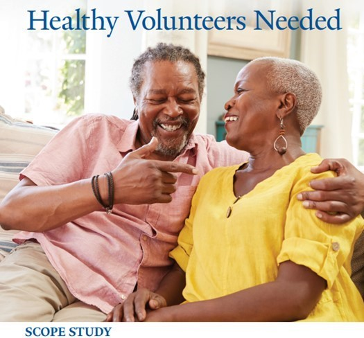

```{r setup, include=FALSE}
knitr::opts_chunk$set(echo = TRUE)
```



If you are **60 years of age or older and healthy**, you may be eligible to participate in a *free and confidential* study to help researchers learn about the normal presence of bacteria in the respiratory tract and how they are transmitted between adults. There may not be a direct benefit to you if you take part, but the information learned from the study may help others in the future. ***Compensation up to \$125 for 6 visits, as well as reimbursement for parking.***

**To learn more or see if you are eligible to participate, please contact us at 1-877-978-8343 or email helpusdiscover\@yale.edu**

HIC\#2000006000
